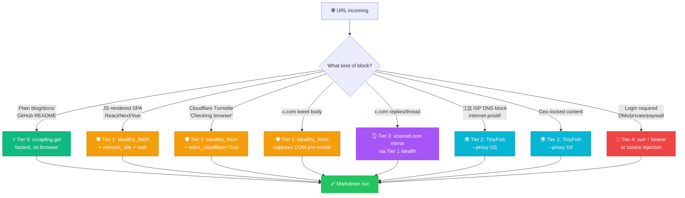

<div align="center">

# 🌐 unblock-web

### **Anti-blok web scraping stack for AI agents**
*Cloudflare Turnstile · ISP DNS poison · X.com login walls — solved.*

[](LICENSE)
[](https://github.com/kevinnft/unblock-web/pkgs/container/unblock-web)
[](https://python.org)
[](https://github.com/Kaliiiiiiiiii-Vinyzu/patchright)
[](#tier-1-scrapling-stealth)
[](https://github.com/kevinnft/unblock-web/actions/workflows/canary.yml)

**🌐 English · 🇮🇩 [Bahasa Indonesia](README.id.md)**

[**🚀 Quick Start**](#-quick-start) · [**📖 Decision Tree**](#-decision-tree) · [**🛡️ Tiers**](#-the-4-tier-stack) · [**🧪 Verified Targets**](#-verified-targets) · [**🤝 Contributing**](#-contributing)

</div>

---

## 🎯 What This Solves

You hit a URL. It returns junk:

```
❌ "Please enable JavaScript"   ← x.com tweets, SPAs
❌ "Checking your browser..."   ← Cloudflare Turnstile
❌ HTTP 403 / 503               ← bot detection
❌ "internet-positif.info"      ← ISP DNS poison (🇮🇩)
❌ "Sign in to view"            ← login walls
```

`unblock-web` is a **decision tree + verified scripts** that pick the right tool for each block class. Drop it into any AI agent (Claude, Hermes, Cursor, Aider, your own) and stop guessing with raw curl/wget/playwright.

> **Status (May 2026):** All 4 tiers verified working on Ubuntu 26.04 + WSL2.

---

## ✨ Features

| 🎨 | What | Why it matters |
|---|---|---|
| 🛡️ | **4-tier escalation** | Right tool per block class — no shotgun retries |
| 🚫 | **Cloudflare Turnstile bypass** | Patchright stealth, no paid SaaS |
| 🐦 | **X.com tweets without login** | DOM captured before login modal mounts |
| 🌏 | **ISP DNS bypass** | Geo-proxy via TinyFish (free unlimited) |
| 🔧 | **Self-healing** | One script reinstalls Chromium when an update wipes it |
| 🩺 | **Built-in canary** | 3-tier health probe, drops into your CI or session-start hook |
| 📦 | **Zero paid services** | Local Chromium + free TinyFish API + free aggregator mirrors |
| 🐍 | **Python stdlib only** | No `requests`, no `httpx`, no extras for the canary itself |

---

## 🚀 Quick Start

Pick your favorite install method. **All four work right now.**

### ⚡ One-liner (zero-config)

```bash
curl -fsSL https://raw.githubusercontent.com/kevinnft/unblock-web/main/scripts/install.sh | bash
```

Picks a working Python (3.11–3.13), creates an isolated venv at `~/.unblock-web`, installs Chromium via `heal`, and symlinks `unblock-web` into `~/.local/bin`. Reversible: `rm -rf ~/.unblock-web ~/.local/bin/unblock-web`.

### 🐍 pip

```bash
pip install 'unblock-web[stealth] @ git+https://github.com/kevinnft/unblock-web.git'
unblock-web heal              # one-time: auto-detects OS, installs Chromium
unblock-web verify            # 3-tier health check
unblock-web fetch https://x.com/elonmusk/status/123456789
```

> *We're on git-install while we wait for PyPI. The git URL works the same as PyPI would. See [docs/publishing.md](docs/publishing.md).*

### 🐳 Docker (zero-install)

```bash
docker run --rm ghcr.io/kevinnft/unblock-web:latest fetch https://example.com

# With TinyFish (Tier 2 geo-proxy)
docker run --rm \
  -e TINYFISH_API_KEY=$TINYFISH_API_KEY \
  ghcr.io/kevinnft/unblock-web:latest fetch https://blocked.com --proxy US
```

### 📦 From source

```bash
git clone https://github.com/kevinnft/unblock-web.git
cd unblock-web
pip install -e '.[stealth]'
unblock-web heal
unblock-web verify --verbose
```

### 🛠️ Library

```python
from unblock_web import fetch

# Auto-pilot — picks the right tier per URL
page = fetch("https://x.com/seelffff/status/2055155782367187375")
print(page.text)
print(f"Used tier: {page.tier}")

# Force ISP/geo bypass
page = fetch("https://web3.okx.com", proxy_country="US")

# Force a specific tier
page = fetch("https://target.com", tier="T1", wait=8000)
```

### 🔌 In an AI agent

Hermes Agent example — drop the canary into session-start:

```yaml
# ~/.hermes/config.yaml
hooks:
  on_session_start:
    - command: "unblock-web verify"
      timeout: 30
```

---

## 📖 Decision Tree



---

## 🛡️ The 4-Tier Stack

### ⚡ Tier 0: Plain HTTP

| | |
|---|---|
| **Tool** | `scrapling.Fetcher().get(url)` |
| **Cost** | Free, ~100ms |
| **Use for** | Static HTML, GitHub READMEs, JSON APIs, blogs without anti-bot |
| **Fails on** | Anything client-rendered |

### 🛡️ Tier 1: Scrapling Stealth (PRIMARY)

| | |
|---|---|
| **Tool** | `mcp_scrapling_stealthy_fetch` / `StealthyFetcher.fetch()` |
| **Engine** | Patchright (anti-fingerprint Chromium fork) |
| **Cost** | Free, local CPU, ~5-15s |
| **Use for** | x.com tweets · Cloudflare Turnstile · React/Next/Vue SPAs · 99% of "hard" pages |
| **Killer flags** | `solve_cloudflare=True`, `network_idle=True`, `wait=5000` |

```python
StealthyFetcher.fetch(
    url,
    network_idle=True,        # wait for XHR settle
    solve_cloudflare=True,    # auto-handle Turnstile JS
    wait=5000,                # ms — let SPA hydrate
)
```

📚 **Full param reference:** [`docs/tier-1-scrapling.md`](docs/tier-1-scrapling.md)

### 🌍 Tier 2: TinyFish (geo-proxy)

| | |
|---|---|
| **Tool** | `scripts/tinyfish_fetch.py` |
| **Engine** | Remote browser farm via REST API |
| **Cost** | **Free unlimited** (no credit card, no rate limit advertised) |
| **Use for** | ISP DNS blocks (🇮🇩 Internet Positif) · geo-locked content · second opinion · when local Chromium is busy |
| **Fails on** | x.com tweets (their SSR drops out before x.com's React boots), login walls |

```bash
python3 scripts/tinyfish_fetch.py "https://blocked-site.com" --proxy US
python3 scripts/tinyfish_fetch.py --search "your query"  # bonus: free search API
```

📚 **Setup + edge cases:** [`docs/tier-2-tinyfish.md`](docs/tier-2-tinyfish.md)

### 🪞 Tier 3: Aggregator Mirrors

| | |
|---|---|
| **Tool** | Tier 1 stealth → `xcancel.com/<user>/status/<id>` |
| **Cost** | Free |
| **Use for** | X/Twitter replies, threads, full conversation context that won't render unauthenticated |
| **Bonus** | Multilingual replies preserved (verified: EN/JP/CN/VI/IT in one fetch) |

📚 **Mirror rotation tips:** [`docs/tier-3-mirrors.md`](docs/tier-3-mirrors.md)

### 🔑 Tier 4: Authenticated APIs

| | |
|---|---|
| **Tool** | [`xurl`](https://github.com/xdevplatform/xurl) + bearer token |
| **Cost** | Free tier (1500 reads/mo on X) |
| **Use for** | DMs · private accounts · POST operations · paywalled content |
| **Setup** | One-time signup at [developer.x.com](https://developer.x.com) |

📚 **Step-by-step bearer setup:** [`docs/tier-4-authenticated.md`](docs/tier-4-authenticated.md)

---

## 🧪 Verified Targets

Stack was tested against these (May 2026) — every result is reproducible:

| 🎯 Target | 🛠️ Tier | 📦 Result |
|---|---|---|
| 🐦 `x.com/<user>/status/<id>` (no auth) | T1 + `wait=5000` | ✅ Full tweet body + meta + view count + quoted tweet |
| 🛡️ `nowsecure.nl` (Cloudflare anti-bot test) | T1 + `solve_cloudflare=True` | ✅ Returns "NOWSECURE / by nodriver" (only served to humans) |
| 🪞 `xcancel.com/<user>/status/<id>` (CF-protected) | T1 + `solve_cloudflare=True` | ✅ Tweet + 11 replies (multilingual) |
| 🇮🇩 `web3.okx.com` (Indonesian ISP block) | T2 + `--proxy US` | ✅ Full JS render + prize pool data |
| 📚 GitHub README | T0 | ✅ Markdown extract |
| 📰 News-site SPA (React) | T1 + `wait=8000` | ✅ Article body |

> **Reproduce these:** see [`examples/`](examples/) for runnable scripts.

---

## 🩺 Health Monitoring

Three layers, **no cron required** (built for laptops that sleep):

### 🚦 Session-start canary

Drop into any agent's session-start hook. Silent on healthy state, alert on regression:

```yaml
# Hermes Agent example (~/.hermes/config.yaml)
hooks:
  on_session_start:
    - command: "/path/to/scripts/verify-stack.py"
      timeout: 30
```

### 🔧 Self-heal on Chromium loss

When `stealthy_fetch` errors with `Executable doesn't exist` (after a venv recreate), auto-run:

```bash
bash scripts/heal-chromium.sh
```

Idempotent. Safe to run anytime.

### 👀 On-demand audit

```bash
python3 scripts/verify-stack.py --verbose
```

---

## 🎨 Why "Anti-Blok"?

Because every "scraping tutorial" online stops at:

> "Just install Playwright! Just use Selenium! Just pay for ScrapingBee!"

Then you hit the *real* world:
- 🇮🇩 ISP poisoning your DNS
- 🇨🇳 GFW dropping your packets
- ☁️ Cloudflare upgrading Turnstile every quarter
- 🐦 X.com adding login walls overnight
- 🐧 Ubuntu 26.04 breaking Playwright install

`unblock-web` is the field-tested decision tree from those battles. **Free tools only.** **No API keys hoarded.** **Reproducible against listed targets.**

---

## 📁 Repository Structure

```
unblock-web/
├── 📖 README.md              ← you are here
├── 📜 LICENSE                 ← MIT
├── 📚 docs/                   ← per-tier deep dives
│   ├── tier-1-scrapling.md
│   ├── tier-2-tinyfish.md
│   ├── tier-3-mirrors.md
│   ├── tier-4-authenticated.md
│   └── ubuntu-26-04-fix.md
├── 🛠️ scripts/                ← drop-in tools
│   ├── verify-stack.py        ← 3-tier canary
│   ├── heal-chromium.sh       ← Ubuntu 26.04 fix
│   └── tinyfish_fetch.py      ← Tier 2 wrapper
├── 🧪 examples/               ← reproducible cases
│   ├── x_com_tweet.py
│   ├── cloudflare_bypass.py
│   ├── indonesian_isp_bypass.py
│   └── xcancel_replies.py
├── ⚙️  .github/workflows/      ← CI canary
│   └── canary.yml
└── 🎨 assets/                 ← logo + diagrams
```

---

## 🤝 Contributing

Found a target the stack can't crack? Open an issue with:

1. ❓ The URL (or pattern)
2. 📋 What each tier returned (paste the failure)
3. 🤔 Hypothesis (login? CF v3? new anti-bot?)

Or send a PR to [`docs/known-targets.md`](docs/known-targets.md) when you find a workaround.

---

## ⚖️ Ethics & Legal

This stack is for **reading publicly accessible content**:

✅ Public tweets, blogs, docs, GitHub  
✅ Content you're entitled to read in a browser  
✅ APIs you have keys for  

❌ **Don't** use it to:
- Scrape behind authentication you don't own
- Violate site Terms of Service
- Mass-extract copyrighted content
- Build credential-harvesting / phishing tools

Respect `robots.txt`. Respect rate limits. Be a good citizen of the open web.

---

## 🙏 Credits

Stack composed from:

- 🛡️ [**Scrapling**](https://github.com/D4Vinci/Scrapling) — the unified scraping library
- 🥷 [**Patchright**](https://github.com/Kaliiiiiiiiii-Vinyzu/patchright) — anti-fingerprint Playwright fork
- 🐟 [**TinyFish**](https://tinyfish.ai) — free fetch + search API for AI agents
- 🪞 [**xcancel.com**](https://xcancel.com) — Twitter content mirror that survives
- 🐤 [**xurl**](https://github.com/xdevplatform/xurl) — official X CLI

---

<div align="center">

**Built with 🥷 by [@kevinnft](https://github.com/kevinnft)**  
*Field-tested in Indonesian internet conditions.*

[⬆ Back to top](#-unblock-web)

</div>
